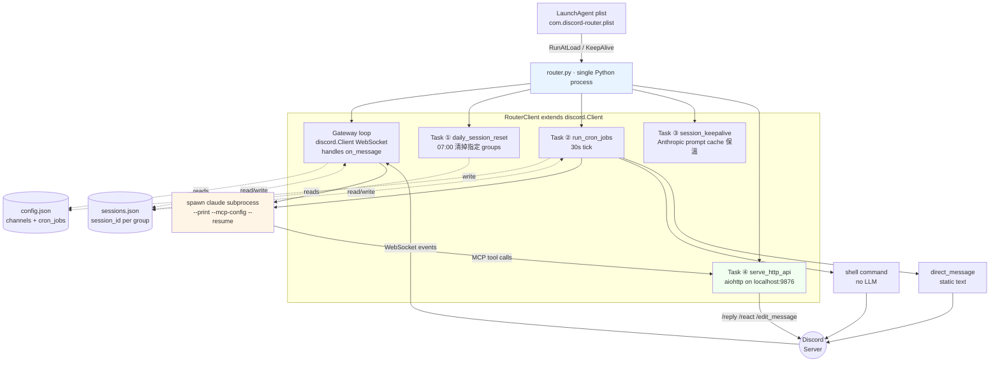
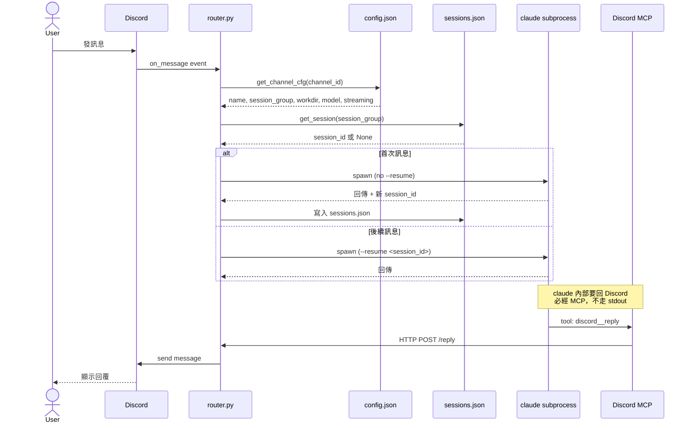
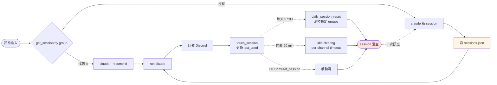
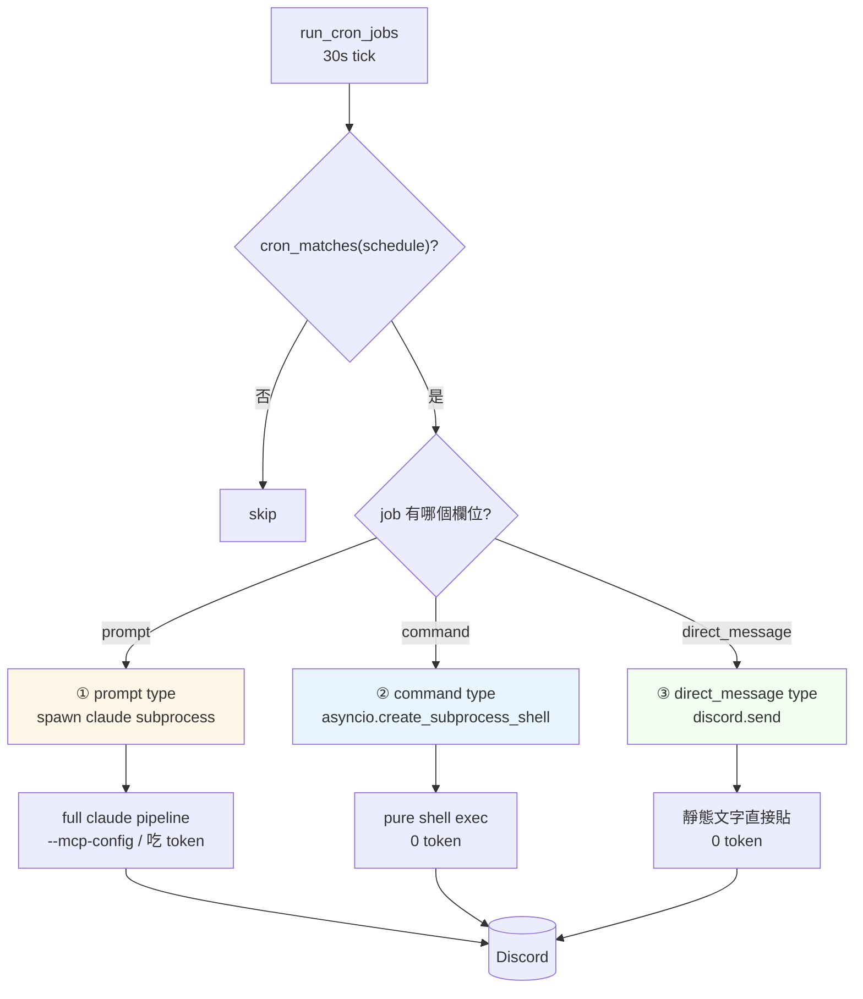

# Discord Router — Architecture

A self-hosted Discord bot that routes messages from different channels to **independent [Claude Code](https://docs.anthropic.com/en/docs/claude-code) sessions**, with a built-in cron scheduler and HTTP API. Each channel maps to a configurable `session_group`: channels in the same group share one Claude session (shared context); channels in different groups stay isolated (no cross-pollution, no wasted tokens).

This document explains how the system actually works at runtime: which files cooperate, what each subsystem is responsible for, and **why** the design ended up this way. For setup instructions and feature list see [README.md](README.md).

---

## 1. System Overview

`launchctl` 啟動 `router.py`（單一 Python 進程）。`RouterClient` 繼承 `discord.Client`，本身就跑著 Discord Gateway 的 WebSocket loop；在 `setup_hook()` 內額外 spawn 四條 async background task：daily reset、cron scheduler、session keepalive、HTTP API。所有 task 共用同一個事件 loop、共用 `sessions.json` 狀態檔、共用 `config.json` 設定。



**設計理由**：把 Gateway、Cron、HTTP 收進同一個進程而非拆三個 service，是為了**共享 session 狀態**——cron 跑出來的結果跟 user 直接對話用的是同一個 session group，context 不分裂。Discord Gateway 不是 spawn 出來的 task，是 `discord.Client` 父類的 runtime；其餘四條 task 是 `setup_hook()` 顯式 `asyncio.create_task` 出來的 background workers。

---

## 2. Message Lifecycle

當 user 在某個 channel 發訊息，整個資料流如下：



**設計理由**：claude 不直接 print stdout 當回覆——所有 Discord 輸出**強制走 MCP → HTTP /reply**。這樣 claude 才能：(a) 在訊息中間 react / edit / 抓 history（多步互動）；(b) 處理 streaming 模式時 router 統一管 rate limit；(c) router 對 claude 的 stdout 只用來抓「session 結果 + token 用量」結構化欄位，不混雜對話內容。

---

## 3. Session Lifecycle

每個 `session_group`（多個 channel 可共享同一 group）有一條 session_id，存在 `sessions.json`。三種情境會清掉 session：



**設計理由**：
- **Per-group session 而非 per-channel**：多個相關 channel（例如同一專案的 main / archive / fact-check）共享 context，避免重複講背景
- **每日 reset**：避免 Claude prompt cache 裡累積過多 stale context（cache 1h TTL，但 session 會 resume 整天的對話），早上重置給 cache 一個乾淨起點
- **60 分閒置自動清**：cron-worker 之類冷頻 session 清掉省 cache slot
- **`daily_reset: false` 可 opt-out**：sniper / line-bot 這類長任務 session 整天不清

---

## 4. Cron Job — Three Dispatch Types

`config.json` 裡的 `cron_jobs` 陣列每筆有 `schedule`（標準 5-field crontab 語法）+ 三種 dispatch 之一：



**設計理由**：cron 的工作不是每樣都需要 LLM。三種型分清楚的好處：
- **prompt 型**（最貴）：給 Claude 動腦的任務（早安雷達 / 派工卡 dispatcher / 圖譜重建）
- **command 型**（中間）：跑現成 shell 腳本後把 stdout 貼到 Discord（備份完成通報、健康狀態），不繞 LLM 省 token
- **direct_message 型**（最便宜）：純定時提醒（運動提醒、靜態 daily ritual），連 shell 都不啟

mixing 這三種讓「**自動化的東西不必都用 AI**」——把 LLM 留給真正需要判斷的場景。

---

## 5. Watchdog 機制

router 內部對 Claude subprocess 有 **idle watchdog**：

- `_run_claude_inner` 跟 `_run_claude_stream_inner` 在跑 subprocess 時持續監看「session jsonl 最後寫入時間」
- 若超過 `idle_threshold_seconds`（預設 180s，可 per-channel / per-cron 覆蓋）沒有任何 transcript 活動 → 判定 hung，殺掉 subprocess
- timeout / idle kill 後會自動 retry 一次（同一 session）；再失敗就清掉 session id 讓下次重新建

**進程級保護**靠 launchd 的 `KeepAlive: true`——router.py 退出 macOS 自動拉起。

**邏輯級保護**（router 本身 hung 但 PID 還在這種狀況）建議**部署時搭配外部 watchdog**：定期打 `GET /healthz` 確認回應，連續失敗則 `launchctl kickstart -k`。本 repo 沒附這個外部 watchdog 的實作（每個部署環境的健康檢查策略不同），但 HTTP API 有把 `/healthz` 接好供呼叫。

---

## 6. 設計原則摘要

| 原則 | 體現 |
|---|---|
| **單一進程、多 task 並行** | router.py 一個 Python 進程跑 Gateway + Cron + HTTP，共享 state |
| **session 是 group 級而非 channel 級** | 多 channel 共享 context 避免重複交代背景 |
| **claude 對外輸出統一走 MCP** | 不混雜 stdout，router 統一管 rate limit + edit / react |
| **cron 三型分流** | LLM 用在判斷，shell 用在固定流程，direct 用在純提醒 |
| **idle watchdog 內建** | router 監看 claude subprocess transcript 活動，hung 即砍並 retry 一次 |
| **狀態盡量檔案化** | `sessions.json` / `config.json` 純 JSON，可手動 grep / patch / diff |

---

## 7. Repo 結構

```
discord-router/
├── router.py              # 主進程（discord.Client + 4 background tasks）
├── http_api.py            # aiohttp endpoints
├── config.example.json    # 設定範本（channels + cron_jobs）
├── README.md              # 安裝 + 功能介紹
├── ARCHITECTURE.md        # 本檔
├── SPEC.md                # 介面 spec
├── requirements.txt       # Python deps
├── mcp-build/             # MCP server 設計筆記（phase 0 ~ 3）
└── mcp/                   # Discord MCP server（fork 自 claude-plugins-official-discord，剝掉 SDK 改走 HTTP）
```

部署時：
- `config.json` — 自己的設定（從 `config.example.json` 複製改寫，**部署者個人化**）
- `sessions.json` — 跨重啟保留的 session_id state（首次跑會自動建）
- `inbox/` — MCP `download_attachment` 暫存目錄

---

## 注意事項

- 本架構文件不涵蓋特定使用者的 channel 配置 / cron 任務細節（屬個人化部分）。`config.example.json` 是公開範本
- 這是 single-user 設計，未做 multi-tenancy；若需要多 user 走 `allowed_users` allowlist + per-user session group 隔離
- Claude Code 是 subprocess 啟動，每次重 spawn 有 cold start cost；高頻 cron 要設 `daily_reset: false` 共用熱 session
